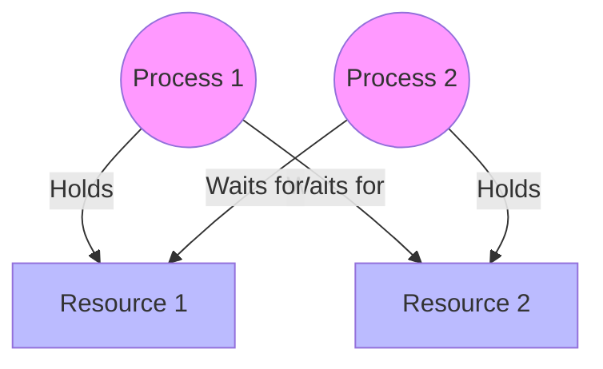

# Table of Contents

1. [Concurrency & Race Conditions](#concurrency-and-race-conditions)
2. [Synchronization Primitives](#synchronization-primitives)
    - [Mutex (with C++ Example)](#mutex-lock)
    - [Semaphores (with C++ Example)](#semaphores)
3. [Classic Problems](#classic-problems)
4. [Deadlocks](#deadlocks)

---

# Concurrency and Race Conditions

**Concurrency** is the execution of multiple instruction sequences at the same time.
**Critical Section (CS):** A segment of code where processes access shared resources (variables, files).

### Race Condition
Occurs when multiple threads access shared data concurrently and the outcome depends on the order of execution.
**Solution:** Ensure **Mutual Exclusion** in the Critical Section.

---

# Synchronization Primitives

## Mutex (Lock)
A locking mechanism used to synchronize access to a resource. Only one thread can acquire the mutex at a time.

### C++ Example: Mutex

```cpp
#include <iostream>
#include <thread>
#include <mutex>

std::mutex mtx; // Global mutex
int shared_counter = 0;

void increment(int id) {
    for (int i = 0; i < 5; ++i) {
        mtx.lock(); // Acquire lock
        // Critical Section
        ++shared_counter;
        std::cout << "Thread " << id << " incremented counter to " << shared_counter << "\n";
        mtx.unlock(); // Release lock
    }
}

int main() {
    std::thread t1(increment, 1);
    std::thread t2(increment, 2);

    t1.join();
    t2.join();

    std::cout << "Final Counter: " << shared_counter << "\n";
    return 0;
}
```

**Expected Output:**
```text
Thread 1 incremented counter to 1
Thread 1 incremented counter to 2
...
Thread 2 incremented counter to 10
Final Counter: 10
```
*(Note: The order of thread execution may vary, but the final count will always be correct due to the mutex.)*

---

## Semaphores
A signaling mechanism. An integer variable used to solve critical section problems.
1.  **Binary Semaphore:** Value 0 or 1 (Similar to Mutex).
2.  **Counting Semaphore:** Value can range over an unrestricted domain (Used for resource management).

### C++ Example: Binary Semaphore (using `std::counting_semaphore`)
*Note: C++20 introduced semaphores.*

```cpp
#include <iostream>
#include <thread>
#include <semaphore>
#include <vector>

// Binary semaphore initialized to 1 (free)
std::binary_semaphore smph(1); 

void worker(int id) {
    smph.acquire(); // Wait (P operation)
    
    // Critical Section
    std::cout << "Thread " << id << " entered Critical Section.\n";
    std::this_thread::sleep_for(std::chrono::milliseconds(100)); // Simulate work
    std::cout << "Thread " << id << " leaving Critical Section.\n";
    
    smph.release(); // Signal (V operation)
}

int main() {
    std::vector<std::thread> threads;
    for(int i = 0; i < 3; ++i) {
        threads.emplace_back(worker, i);
    }

    for(auto& t : threads) {
        t.join();
    }
    return 0;
}
```

**Expected Output:**
```text
Thread 0 entered Critical Section.
Thread 0 leaving Critical Section.
Thread 2 entered Critical Section.
Thread 2 leaving Critical Section.
Thread 1 entered Critical Section.
Thread 1 leaving Critical Section.
```
*(Only one thread enters the CS at a time.)*

---

# Classic Problems

### Dining Philosophers Problem
5 philosophers sit at a table with 5 forks. To eat, a philosopher needs 2 forks (left and right).
**Issue:** Deadlock if everyone picks up the left fork simultaneously.
**Solution:**
-   Allow max 4 philosophers.
-   Pick up both forks atomically.
-   **Odd-Even Rule:** Odd philosophers pick left then right; Even pick right then left.

---

# Deadlocks

A situation where a set of processes are blocked because each process is holding a resource and waiting for another resource acquired by some other process.

### Necessary Conditions (Coffman Conditions)
Deadlock can arise if **all four** hold simultaneously:
1.  **Mutual Exclusion:** Non-sharable resources.
2.  **Hold and Wait:** Process holds a resource while waiting for others.
3.  **No Preemption:** Resources cannot be forcibly taken.
4.  **Circular Wait:** P0 waits for P1, P1 waits for P2... Pn waits for P0.



### Handling Deadlocks

#### 1. Deadlock Prevention
Ensure at least one of the 4 conditions cannot hold.
-   **No Mutual Exclusion:** Use sharable resources (read-only files).
-   **No Hold & Wait:** Request all resources at start.
-   **No Circular Wait:** Order resources and request in increasing order.

#### 2. Deadlock Avoidance
OS decides dynamically whether to grant a request.
-   **Banker's Algorithm:** Checks if granting a request leaves the system in a **Safe State**. If yes, grant; else, wait.

#### 3. Deadlock Detection & Recovery
-   Allow deadlock to happen, then detect it (Wait-for graph).
-   **Recovery:** Terminate processes or preempt resources.

#### 4. Deadlock Ignorance (Ostrich Algorithm)
-   Pretend deadlock never occurs (Used by Windows/Linux/Unix).
