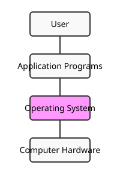
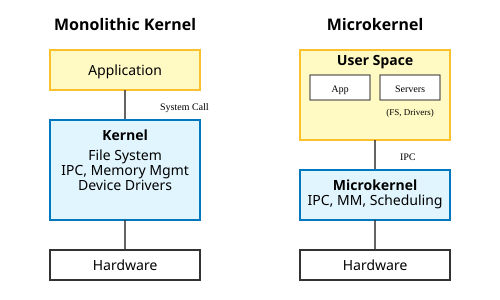

# Table of Contents

1. [Introduction to Operating Systems](#introduction-to-operating-systems)
2. [Types of Operating Systems](#types-of-operating-systems)
3. [Components of OS](#components-of-os)
4. [System Calls](#system-calls)
5. [Booting Process](#booting-process)
6. [32-Bit vs 64-Bit OS](#32-bit-vs-64-bit-os)

---

# Introduction to Operating Systems

> **Definition:** An operating system is a piece of software that manages all the resources of a computer system, both hardware and software, and provides an environment in which the user can execute his/her programs in a convenient and efficient manner.

It acts as an **interface** between the user and the computer hardware, hiding the underlying complexity (Abstraction) and acting as a resource manager (Arbitration).

### Why do we need an OS?
1.  **Complexity Management:** Without an OS, applications would need to handle low-level hardware interaction, making them bulky and complex.
2.  **Resource Management:** Prevents resource exploitation by a single app and ensures fair usage.
3.  **Protection:** Provides memory protection and isolation between processes.

### OS Functions
-   Access to computer hardware.
-   Resource management (Memory, Device, File, Security, Process, etc.).
-   Hiding hardware complexity.
-   Facilitating execution of application programs.

---

# Types of Operating Systems

### 1. Single Process OS
-   Only one process executes at a time from the ready queue.
-   **Example:** MS-DOS (1981).

### 2. Batch-Processing OS
-   Jobs are grouped into batches with similar needs.
-   Batches are submitted to the processor one by one.
-   **Issues:** No priority setting, potential starvation, CPU idle during I/O.
-   **Example:** ATLAS (late 1950s).

### 3. Multiprogramming OS
-   Increases CPU utilization by keeping multiple jobs in memory.
-   When one job waits for I/O, the CPU switches to another job.
-   **Key:** Context switching happens when the current process goes to a wait state.

### 4. Multitasking OS (Time-Sharing)
-   Logical extension of multiprogramming.
-   CPU switches between tasks so frequently that users can interact with each program while it is running.
-   **Key:** Time sharing + Context switching. Increases responsiveness.

### 5. Multi-Processing OS
-   Uses more than one CPU in a single computer.
-   **Benefits:** Increased reliability, better throughput, less starvation.
-   **Example:** Windows NT.

### 6. Distributed OS
-   Manages a collection of independent, networked, communicating, and physically separate computational nodes.
-   **Example:** LOCUS.

### 7. Real-Time OS (RTOS)
-   For systems requiring rigid time requirements for operation.
-   **Example:** Air Traffic Control Systems, Robots.

---

# Components of OS

### 1. Kernel
The core component that interacts directly with hardware. It is the first part of the OS to load.
-   **Functions:** Process management, Memory management, File management, I/O management.

### 2. User Space
Where application software runs. Apps interact with the kernel via System Calls.

### Types of Kernels

| Feature | Monolithic Kernel | Micro Kernel | Hybrid Kernel |
| :--- | :--- | :--- | :--- |
| **Structure** | All functions in kernel space | Only major functions (IPC, Memory, Process) in kernel | Combined approach |
| **Size** | Bulky | Smaller | Moderate |
| **Reliability** | Less (one crash brings down system) | More (modular) | High |
| **Performance** | High (fast communication) | Slow (context switch overhead) | Balanced |
| **Examples** | Linux, Unix, MS-DOS | L4 Linux, Symbian, MINIX | MacOS, Windows NT/7/10 |

---

# System Calls

A **System Call** is a mechanism used by a user program to request a service from the kernel. It is the only way a process can enter kernel mode from user mode.

### Types of System Calls
1.  **Process Control:** `fork()`, `exit()`, `wait()`
2.  **File Management:** `open()`, `read()`, `write()`, `close()`
3.  **Device Management:** `ioctl()`, `read()`, `write()`
4.  **Information Maintenance:** `getpid()`, `alarm()`, `sleep()`
5.  **Communication:** `pipe()`, `shmget()`, `mmap()`

---

# Booting Process

**What happens when you turn on your computer?**

1.  **Power On:** CPU initializes and looks for BIOS/UEFI.
2.  **POST (Power On Self Test):** BIOS tests and initializes hardware.
3.  **Bootloader Handoff:** BIOS looks for the Master Boot Record (MBR) or EFI partition and executes the bootloader (e.g., GRUB, Windows Boot Manager).
4.  **Kernel Loading:** Bootloader loads the OS Kernel into memory.
5.  **User Space:** Kernel starts system processes and finally the user space (GUI/CLI).

---

# 32-Bit vs 64-Bit OS

| Feature | 32-Bit OS | 64-Bit OS |
| :--- | :--- | :--- |
| **Addressable Memory** | 2^32 (4 GB) | 2^64 (17 Billion GB) |
| **Data Processing** | 4 bytes per cycle | 8 bytes per cycle |
| **Compatibility** | Runs only 32-bit apps | Runs 32-bit and 64-bit apps |
| **Performance** | Lower | Higher (larger registers, better graphics) |
