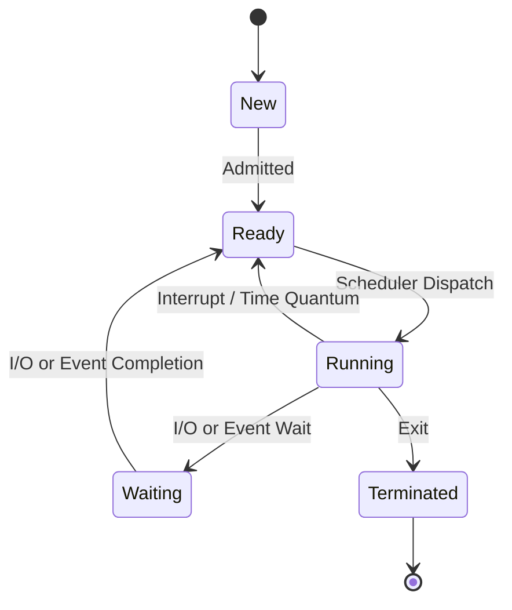
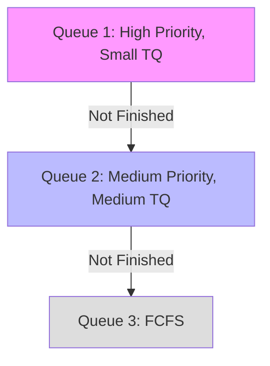

# Table of Contents

1. [Program vs Process vs Thread](#program-vs-process-vs-thread)
2. [Process Management](#process-management)
3. [Process States](#process-states)
4. [Context Switching](#context-switching)
5. [CPU Scheduling](#cpu-scheduling)
    - [Scheduling Algorithms](#scheduling-algorithms)

---

# Program vs Process vs Thread

| Term | Definition | Location |
| :--- | :--- | :--- |
| **Program** | Executable file (compiled code) containing a set of instructions. | Disk |
| **Process** | A program under execution. | RAM (Primary Memory) |
| **Thread** | A light-weight process; an independent path of execution within a process. | RAM (within Process) |

### Multi-Tasking vs Multi-Threading

-   **Multi-Tasking:** Execution of more than one task simultaneously (e.g., running Browser and Music Player). Involves process context switching.
-   **Multi-Threading:** A process is divided into several sub-tasks (threads) to achieve parallelism (e.g., Browser tabs). Threads share the same memory space of the process.

---

# Process Management

### Process Architecture
When a program is loaded into memory, it becomes a process with:
-   **Stack:** Temporary data (function parameters, return addresses).
-   **Heap:** Dynamically allocated memory.
-   **Data:** Global and static variables.
-   **Text:** The program code (instructions).

### Process Control Block (PCB)
Each process is tracked by the OS using a data structure called PCB. It contains:
-   Process ID (PID)
-   Program Counter (PC)
-   Process State
-   Priority
-   Registers
-   Memory Limits

---

# Process States

A process changes state during its execution:

1.  **New:** Process is being created.
2.  **Ready:** Waiting to be assigned to a processor (in Ready Queue).
3.  **Running:** Instructions are being executed.
4.  **Waiting:** Waiting for some event (like I/O).
5.  **Terminated:** Finished execution.

### Special Processes
-   **Orphan Process:** Parent terminated, but child is still running. Adopted by `init`.
-   **Zombie Process:** Child terminated, but parent hasn't read its exit status yet (still in process table).

---

# Context Switching

The process of saving the state of the current process (in its PCB) and loading the saved state of a new process.
-   **Pure Overhead:** System does no useful work during switching.
-   **Thread Context Switching:** Faster than process switching as it doesn't involve switching memory address spaces (TLB flush not required).

---

# CPU Scheduling

**Goal:** Maximize CPU utilization and Throughput; Minimize Turnaround Time (TAT), Waiting Time (WT), and Response Time.

### Types
1.  **Non-Preemptive:** Process keeps CPU until it terminates or waits.
2.  **Preemptive:** CPU can be taken away (e.g., time quantum expires, higher priority job arrives).

### Scheduling Algorithms

#### 1. First Come First Serve (FCFS)
-   **Type:** Non-preemptive.
-   **Issue:** **Convoy Effect** (Short process stuck behind a long process).

#### 2. Shortest Job First (SJF)
-   **Type:** Non-preemptive.
-   **Criteria:** Shortest Burst Time (BT) first.
-   **Issue:** Starvation of long processes. Hard to predict BT.

#### 3. Shortest Remaining Time First (SRTF)
-   **Type:** Preemptive version of SJF.
-   **Benefit:** Minimum average waiting time.

#### 4. Priority Scheduling
-   **Type:** Preemptive or Non-preemptive.
-   **Issue:** **Starvation** (Low priority jobs may never execute).
-   **Solution:** **Aging** (Gradually increase priority of waiting jobs).

#### 5. Round Robin (RR)
-   **Type:** Preemptive (Time Quantum).
-   **Use:** Time-sharing systems.
-   **Pros:** Fairness, response time.
-   **Cons:** High context switch overhead if Time Quantum is too small.

#### 6. Multi-Level Queue (MLQ)
-   Ready queue partitioned into separate queues (e.g., System, Interactive, Batch).
-   Fixed priority between queues.
-   **Issue:** Starvation of lower-level queues.

#### 7. Multi-Level Feedback Queue (MLFQ)
-   Allows processes to move between queues.
-   Uses **Aging** and feedback to prevent starvation and handle different process types dynamically.

